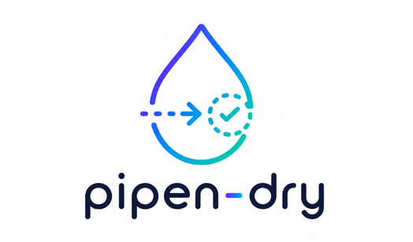

<div align="center">
    

   <p style="font-weight:bold;">Dry runner for <a href="https://github.com/pwwang/pipen" target="_blank">pipen</a></p>

</div>

It is useful to quickly check if there are misconfigurations for your pipeline without actually running it.

## Install

```shell
pip install -U pipen-dry
```

## Usage

- Use it for process

    ```python
    class P1(Proc):
        scheduler = "dry"
    ```

- Use it for pipeline

    ```python
    Pipen(scheduler="dry", ...)
    ```

[1]: https://github.com/pwwang/pipen
